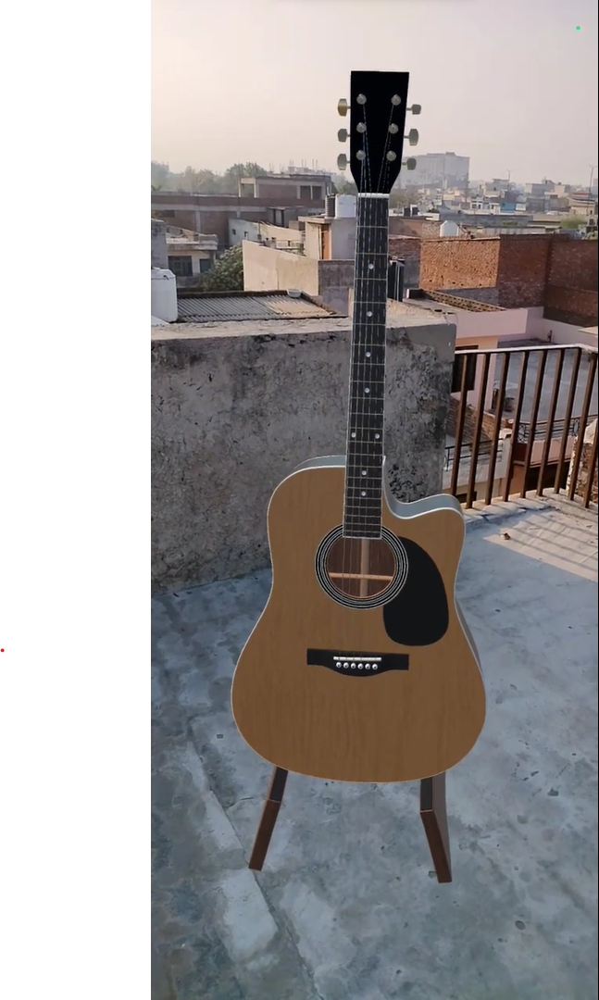

# 💡 Spatial Audio for Immersiveness

## 💡 Introduction
Spatial audio is an audio technique that creates the illusion of sound sources existing in a three-dimensional space around the listener. In this case study, we will explore how spatial audio can be used in conjunction with ARCore's motion tracking to create an immersive audio experience.

## 💡 Background
Spatial audio can be achieved using different methods, such as ambisonics or binaural audio, which can produce a surround sound experience. In recent years, spatial audio has become more accessible and affordable, and it is being used in various applications, such as virtual reality (VR) and augmented reality (AR).

## 💡 Case Study
In this project, we have created an augmented reality (AR) experience that uses ARCore's motion tracking to track the position of the user and spatial audio to simulate the sound of musical instruments, such as a piano, a guitar, and a violin. The experience is designed to be an interactive exhibit that allows users to explore and listen to the different instruments, as if they were in the same room with them.

The experience uses spatial audio to create a realistic and immersive audio experience. As users move closer to an instrument, such as the piano, the sound of the piano becomes more prominent, and users can hear the notes being played from the instrument. The same happens when users approach the guitar or violin, and they can hear the sounds of these instruments being played.

The spatial audio is achieved using Unity's Ambisonics 3D Spatial Audio System, which simulates the way sound travels through the ears and is processed by the brain. This creates the illusion of sound sources being located in a specific position in space, such as the position of the virtual instruments in the AR experience.

The motion tracking feature of ARCore is used to detect the position and movements of the user. As users move closer to an instrument, the sound of that instrument becomes more prominent, and users can hear the notes being played from the instrument.

## 💡 Conclusion

This AR experience is an example of how spatial audio can be used in conjunction with ARCore's motion tracking to create an immersive and interactive audio experience. By combining spatial audio with motion tracking, we have created an exhibit that simulates the experience of being in a real room with virtual musical instruments. This project shows the potential of spatial audio in creating new and innovative audio experiences that engage and entertain users in an augmented reality setting.

## ⚒️ Development Tools
- Unity Engine 2021.3.15f1
- AR Foundation 4.2.7
- AR Core XR Plugin 4.2.7

## ⚒️ Running Locally
Make sure to use Unity 2020 or higher versions for this project to work properly.
* Download [Unity Hub](https://unity3d.com/get-unity/download "Unity Hub")
* Install Unity version 2020 or higher 
</img>
* Install Android Build Support, OpenJDK, Android SDK & NDK Tools
</img>
* Clone the repository `git clone https://github.com/Priyanshu-CODERX/spatial-musical-ar.git`
* Open the project with your Unity Engine
* Switch build platform to Android
* Go to project setting's and change the minimum api level to `Android 7.0 API Level 23`
* Build the apk

## 💡 Spatial Musical Demo
